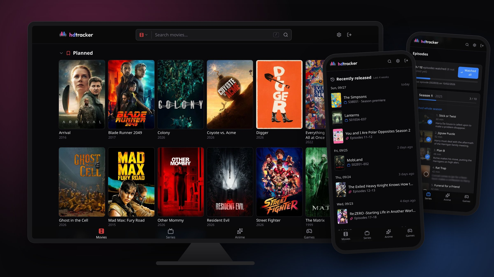
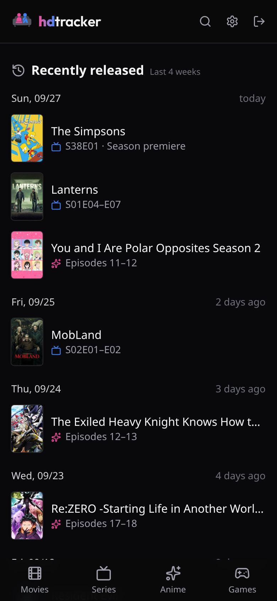
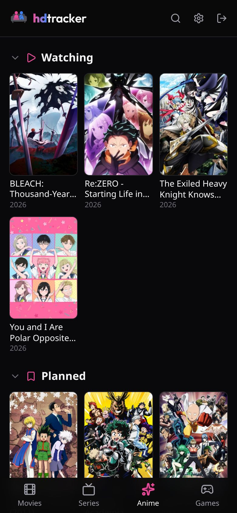
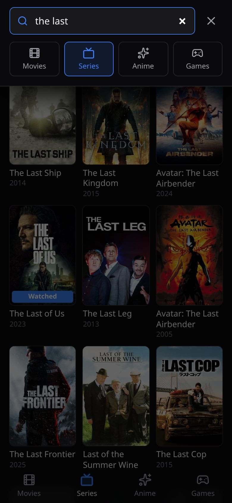
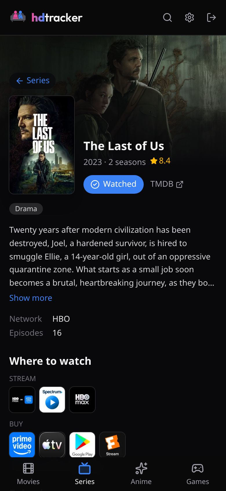
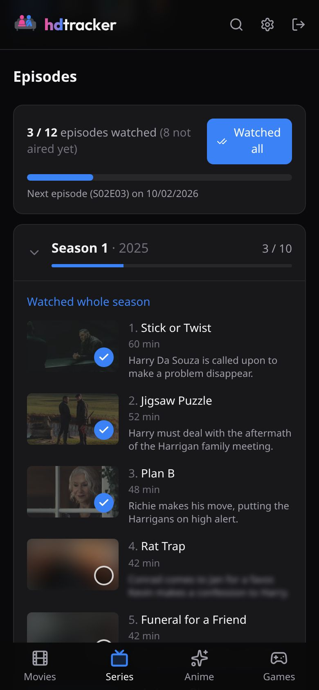
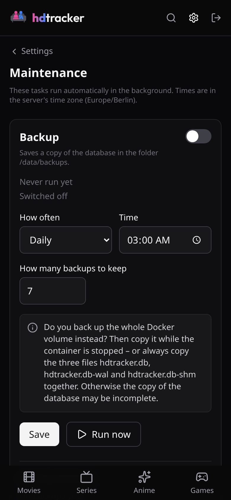

<!-- Logo with wordmark; GitHub picks the variant matching its light or dark theme -->
<p align="center">
  <picture>
    <source media="(prefers-color-scheme: dark)" srcset="docs/brand/wordmark-dark.png" />
    
  </picture>
</p>

<p align="center">
  <a href="https://github.com/dvnkln/hdtracker/releases"></a>
  <a href="https://github.com/dvnkln/hdtracker/pkgs/container/hdtracker"></a>
  <a href="LICENSE"></a>
</p>

<p align="center">
  Self-hosted tracker for <b>movies</b>, <b>series</b>, <b>anime</b> and <b>games</b> – made for watching together on the couch.
</p>

<p align="center">
  
</p>

## 📖 Documentation

The guides live in the **[wiki](https://github.com/dvnkln/hdtracker/wiki)**:

- 🐳 [Installation](https://github.com/dvnkln/hdtracker/wiki/Installation) – Docker Compose, the `.env` file, API keys
- 🔐 [HTTPS and installing as an app](https://github.com/dvnkln/hdtracker/wiki/HTTPS-and-installing-as-an-app) – reverse proxy, `ORIGIN`, home screen
- ⬆️ [Updating](https://github.com/dvnkln/hdtracker/wiki/Updating)
- 💾 [Backups and restore](https://github.com/dvnkln/hdtracker/wiki/Backups-and-restore)
- 📥 [Import from Yamtrack](https://github.com/dvnkln/hdtracker/wiki/Import-from-Yamtrack)
- 🛡️ [Privacy and security](https://github.com/dvnkln/hdtracker/wiki/Privacy-and-security) – what is sent where, how your data is stored
- 🔑 [Reset your password](https://github.com/dvnkln/hdtracker/wiki/Reset-your-password)
- 💻 [Development](https://github.com/dvnkln/hdtracker/wiki/Development) – running hdtracker from source

What changed in each version: [Changelog](CHANGELOG.md). What's planned: [Roadmap](ROADMAP.md).

## ✨ Features

- 🎬 **Four separate areas** – movies, series, anime and games, each with a library grouped by status (watching, paused, planned, completed, dropped). Don't track games or anime? Hide the areas you don't need.
- 📅 **Dashboard** – what was released recently and what is coming up: new episodes, new seasons, cinema and home releases, game releases.
- 📺 **Episode tracking** – tick off single episodes, whole seasons or entire shows; see upcoming episodes and announced seasons with dates.
- 🙈 **Spoiler protection** – images and descriptions of episodes you have not watched yet are blurred (can be switched off).
- 🍿 **Where to watch** – streaming, rent and buy offers for your region (via JustWatch), with direct links where possible.
- 🔎 **Quick search** – always at the top of the screen; on a computer, press <kbd>/</kbd> to start typing.
- 📄 **Detail pages** – runtime, genres, rating, release dates and similar titles.
- 📥 **Import from Yamtrack** – take over your library including statuses, watched episodes and anime progress.
- 🛠️ **Maintenance built in** – release dates refresh nightly; optional scheduled database backups you can download.
- 🔒 **Private** – runs on your own server, single account, all data in one SQLite file. No tracking, no cloud – [what is sent where](https://github.com/dvnkln/hdtracker/wiki/Privacy-and-security) is documented.

## 📱 Screenshots

|                                Dashboard                                 |                                 Library                                  |                               Search                               |
| :----------------------------------------------------------------------: | :----------------------------------------------------------------------: | :----------------------------------------------------------------: |
|  |  |  |

|                         Details & where to watch                         |                     Episodes (spoiler protection)                      |                                 Maintenance                                  |
| :----------------------------------------------------------------------: | :--------------------------------------------------------------------: | :--------------------------------------------------------------------------: |
|  |  |  |

<p align="center"><sub>Screenshots with a demo library. Posters and data from TMDB, AniList and IGDB.</sub></p>

## 🐳 Quick start

1. Create a folder with this `docker-compose.yml`:

   ```yaml
   services:
     hdtracker:
       image: ghcr.io/dvnkln/hdtracker:latest
       container_name: hdtracker
       restart: unless-stopped
       ports:
         - '3000:3000'
       env_file: .env
       volumes:
         - hdtracker-data:/data

   volumes:
     hdtracker-data:
   ```

2. Next to it, create a `.env` file (template: [`.env.example`](.env.example)) with a random `SECRET`, your API keys for TMDB and IGDB, your time zone and `ORIGIN` – **exactly** the address you open the app with, e.g. `http://192.168.1.50:3000`.

3. Start it and open that address. On first start you create your account.

   ```bash
   docker compose up -d
   ```

Where to get the keys and what every setting means: **[Installation guide](https://github.com/dvnkln/hdtracker/wiki/Installation)**.

## 🙏 Data sources

Movie and series data from [TMDB](https://www.themoviedb.org). This product uses the TMDB API but is not endorsed or certified by TMDB. Streaming availability by [JustWatch](https://www.justwatch.com). Game data from [IGDB](https://www.igdb.com), anime data from [AniList](https://anilist.co).

## 🤖 Built with AI

hdtracker is heavily AI-assisted, and I want to be upfront about that. Most of the code was written by [Claude Code](https://claude.com/claude-code), Anthropic's AI coding assistant.

My part is the product side: what hdtracker should do, how it should look and feel, and how it should behave – from the layout and hover effects to things like loading data from the different services in parallel. I describe ideas and decisions, review and test every change in a running instance, and decide what goes into a release. The AI turns that into code, tests it and documents it.

If you find a bug or something that looks odd in the code, please open an [issue](https://github.com/dvnkln/hdtracker/issues) – that helps.

## 📜 License

[GNU AGPL v3](LICENSE) – you may use, change and share hdtracker freely. If you distribute a modified version or offer it to others over a network, you have to publish your changes under the same license. This is a personal project, provided as-is without support or guarantees; if it's useful to you too, even better.
